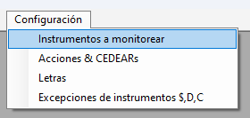
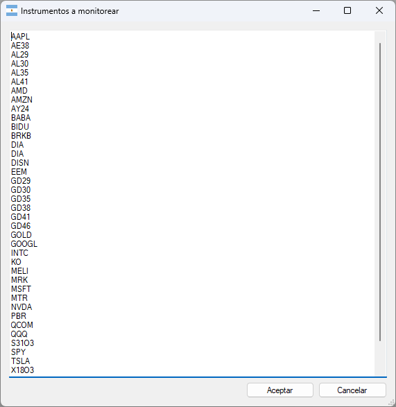
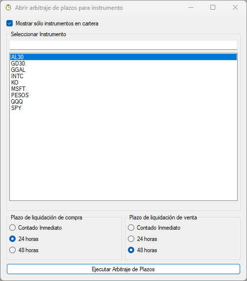

# Chucho Bot 🤖

## Requerimientos

Para poder ejecutar la aplicación es necesario:

- Windows
- Microsoft .Net Framework 4.7.2
- Acceso a Primary API provisto por ALyC (Matriz)

> Nota: No funciona en iOS, MacOS, Android o Linux.

## ¿Cómo puedo ejecutar la aplicación?

Los releases se encuentran en la sección `Releases`

- Ir a la sección [Releases](https://github.com/ChuchoCoder/chuchobot/releases)
- Descargar el archivo zip (Ejemplo: `ChuchoBot2023-10-06.zip`)
- Descomprimir en una carpeta
- Ejecutar `ChuchoBot.exe`

## ¿Cuál es la Primary API Base URL de mi ALyC?

En la ventana de **Primary Login**, reemplazar la `Primary API Basi URL` por la provista por ALyC. **Ejemplo**: Si tenés **Bull Market Brokers** usa `https://api.bull.xoms.com.ar`


- **Cocos Capital (requiere plan 🥥 Cocos Pro)**: ```https://api.cocos.xoms.com.ar```
- **Eco Valores**: `https://api.eco.xoms.com.ar`
- **Veta Capital**: `https://api.veta.xoms.com.ar`
- **Bull Market Brokers**: `https://api.bull.xoms.com.ar`
- **Cohen**: `https://api.cohen.xoms.com.ar`
- **Adcap**: `https://api.adcap.xoms.com.ar`
- **BCCH**: `https://api.bcch.xoms.com.ar`

> Listado de agentes ofrecen acceso a Matriz: [https://www.matbarofex.com.ar/agentes-dma](https://www.matbarofex.com.ar/agentes-dma)

### ¿Cúal es mi usuario y contraseña para hacer Login?

El usuario y contraseña a utilizar es el mismo que se utiliza para ingresar en Matriz.

## ¿Cómo configuro los Derechos de Mercado para los distintos instrumentos?

La aplicación tiene configurado algunos instrumentos (no todos) que son utilizados para calcular automáticamente los Derechos de Mercado:

- **Acciones y CEDEARs 0,08%** (Instrumentos en setting `AccionesCEDEARs`)
- **Letras 0,001%** (Instrumentos en setting `Letras`)
- **Bonos 0,01%** (resto de instrumentos)

Además de los derechos de mercado, la comisión configurada por cada operación es de 0,10% (por defecto). Este porcentaje puede modificarse en la ventana de Arbitrajes de Plazos

**Derechos de Mercado BYMA**: https://www.byma.com.ar/wp-content/uploads/dlm_uploads/2019/11/BYMA-Derechos-Mercado-sobre-Operaciones-2022-12-01.pdf

## ¿Cómo configuro la comisión de caución tomadora y colocadora?

La aplicación tiene configurado valores arbitrarios para la comisión que cobra el broker al momento de colocar o tomar caución. 

Para obtener un P&L correcto, es necesario configurar estos valores en los campos `Comisión Tomadora (TNA)` y `Comisión Colocadora (TNA)`. Estos valores se configuran en la ventana del scanner de arbitrajes de plazos

## ¿Cómo agregar/eliminar instrumentos a monitorear?

1. Ir a `Configuración` => `Instrumentos a monitorear`

    

2. Agregar o quitar instrumentos a la lista (1 instrumento por linea). **Ejemplo**: Agregar `GGAL` para monitorear la acción de Galicia.

    

## ¿Puedo utilizar la aplicación si no tengo acceso a Matriz?

No, la aplicación necesita tener acceso a Primary API (Matriz).

## Scanner de arbitraje de plazos de liquidación

El scanner de arbitraje de plazos permite detectar oportunidades para arbitrar plazos de distintos activos.

Opciones:

- **Ver sólo arbitrajes de según instrumentos en cartera**: Muestra sólo los arbitrajes que son posibles evaluando los instrumentos que se tienen en cartera.
- **Ver sólo arbitrajes con profit**: Muestra sólo los arbitrajes donde la ganancia (columna P&L) sea positiva


Haciendo doble clic en cualquier de las filas de la grilla se accede una ventana con el detalle del arbitraje. En dicha ventana se pueden cambiar los nominales, precios de compra/venta y comisión para poder obtener un cálculo aproximado de la ganancia/pérdida que se obtendría.


### Operatoria cuando el plazo de la Venta es menor al de Compra (requiere títulos en cartera)

Cuando el plazo de liquidación de la `1 Venta` es menor al de `2 Compra` es necesario contar con los títulos en cartera (Ejemplo: `1 Venta NVDA - CI` / `2 Compra NVDA - 24hs`).

La operación consiste en realizar las siguientes operaciones:

1. **Vender** el título en el plazo visualizado `CI`
2. **Comprar** el título en el plazo visualizado `24hs`
3. **Colocar** en caución el resultado de la venta del paso **1**

### Operatoria cuando el plazo de la Venta es mayor al de Compra

Cuando el plazo de liquidación de la `1 Venta` es mayor al de `2 Compra` será necesario contar con el dinero o poder tomar caución para cubrir el descubierto de lo comprado (Ejemplo: `1 Venta SPY - 24hs` / `2 Compra SPY - CI`).

La operación consiste en realizar las siguientes operaciones:

1. **Comprar** el título en el plazo visualizado `CI`
2. **Vender** el título en el plazo visualizado `24hs`
3. **Tomar** caución por el total de la compra del paso **1**

### ¿Cómo puedo abrir la ventana de arbitraje de plazos de liquidación para un instrumento determinado?

Es posible abrir la ventana de arbitraje para un determinado instrumento y plazos de liquidación haciendo click en el menu `Arbitrajes de Plazos` > `Seleccionar intrumento y Plazos`.

En esta ventana es necesario seleccionar:
1. Instrumento
2. Plazo de liquidación de compra
3. Plazo de liquidación de venta



## Operatoria Rotación de Activos (Ratio)

La rotación de activos consiste en **vender el caro** y **comprar el activo barato**. Ejemplo: Vender GD30 y comprar AL30 o viceversa.

### ¿Cómo sabemos cuando un activo está más caro o barato que el otro?

Para poder determinar cuando un activo está caro o barato en comparación a otro podemos visualizar la relación (ratio) de los mismos a lo largo del tiempo. Esta relación es surge simplemente dividiendo Activo 1/Activo 2. 

Es imposible estar seguros de que un activo está más barato o caro que el otro, solo podemos suponer o asumir sobre esto mirando dicha relación.

### ¿Cómo puedo visualizar la relación (ratio) entre 2 activos?

En TradingView esto se puede lograr utilizando el Indicador Ratio. Ejemplo: 
1. Ingresamos al grafico de **GD30**
2. Click en **Indicadores** 
3. Click **Ratio**
4. Ingresamos **AL30** y click en el botón **Aplicar**

### ¿Cómo es la operatoria de rotación de activo (ratio)?

La operatoria de rotación de activo (ratio) consiste en:
1. Comprar el activo "barato"
2. Vender el activo "caro" por el mismo monto total

Ejemplo:
- El precio de GD30 es $60.000 y el de AL30 es $55.000, el ratio de GD30/AL30 es de 9,09% y nuestra hipotesis es que AL30 esta más barato que GD30 (es decir, AL30 tendría que subir más o bajar menos que GD30)
- Abrimos posición:
  - Compramos 10.909 nominales de AL30 (Total -$5.999.950)
  - Vendemos 10.000 nominales de GD30 (Total +$6.000.000)
    - **Importante**: No vendemos la misma cantidad de nominales, vendemos los nominales en función al ratio. Es decir, utilizamos el mismo monto total del activo que compramos del que vendemos.
- Pasa el tiempo y el precio de GD30 es $59.000 y el de AL30 es de $54.500, lo que ahora da un ratiode GD30/AL30 de 8,25%
- Cerramos posición:
  - Vendemos 10.909 nominales de AL30 (Total +$5.945.405)
  - Compramos 10.000 nominales de GD30 (Total -$5.900.000)
  - Obtuvimos una ganancia de $45.405

> IMPORTANTE: Para simplificar la operatoria y c{alculo no se incluyeron comisiones ni derechos de mercado.

## Scanner para comprar/vender dolar MEP y CCL

La aplicación permite visualizar en tiempo real en que instrumentos conviene Comprar o Vender dolar MEP/CCL.

Es posible abrir abrir la ventana de dolar MEP/CCL para Compra/Venta haciendo click en el menú `Dolar`:
- 

### Dolar MEP


### Dolar CCL


## Preguntas frecuentes

### ¿Qué es el arbitraje de plazos de liquidación?

Video: [https://www.youtube.com/watch?v=i0xQ3_KqdHI](https://www.youtube.com/watch?v=i0xQ3_KqdHI)

### ¿Por qué aparece el icono de WiFi rojo y el texto "DISCONNECTED"?

Cuando la aplicación deja de recibir datos por WebSocket, el icono de WiFi pasa de verde a rojo para avisar que puede existir algún problema con la conexión. Esto también ocurre antes de la apertura y luego de la finalización de la rueda.


Si esto ocurre mientras el mercado está abierto, se recomienda cerrar la apliación y volver a ejecutarla.

### ¿La aplicación recibe datos en tiempo real?

Sí, la aplicación se conecta por WebSocket a Primary API y la misma recibe los datos de los instrumentos en tiempo real.

### ¿La aplicación envía alguna orden de compra o venta?

No, la aplicación no emite o envía ninguna orden de compra y venta al mercado. Solamente permite visualizar las oportunidades de arbitraje que existen en tiempo real.

### ¿Cómo puedo configurar el instrumento D o C?

Existen instrumentos donde el ticker para `D` y `C` no sigue la convención `{Ticker}D` o `{Ticker}C`. Por ejemplo: Para la letra del tesoro `X20Y4` el ticker para `D` (dolar MEP) es `XY4D` y para `C` es `XY4C`.

Estas excepciones se pueden configurar haciendo click en el menú `Configuración` > `Excepciones de instrumentos $;D;C`.

Ingresar la excepción separando con `;` cada ticker usando el formato **`{Ticker $ Pesos};{Ticker D MEP};{Ticker C CCL}`**. 

Ejemplo: `X20Y4;XY4D;XY4D`


### ¿Cómo deshabilito la Telemetría?

Para deshabilitar la telemetría de la aplicación:

1. Editar el archivo de configuración `ChuchoBot.exe.config`
2. Eliminar sección de `<connectionStrings>...</connectionStrings>``

```xml
  <connectionStrings>
    <add name="Primary.WinFormsApp.Properties.Settings.AppInsightsConnectionString"
      connectionString="..." />
  </connectionStrings>
```