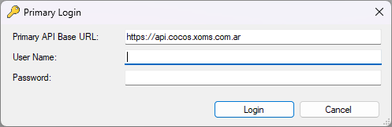
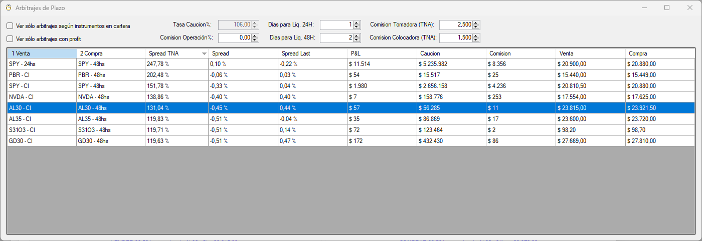
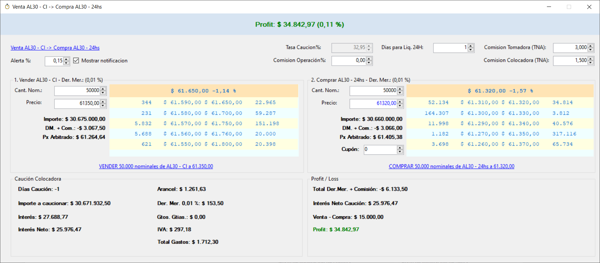
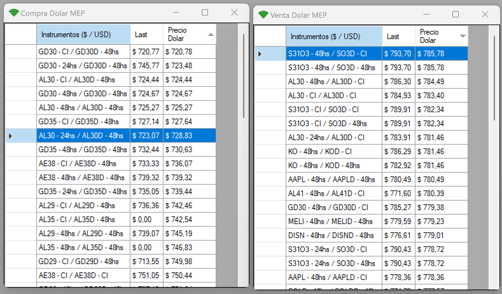
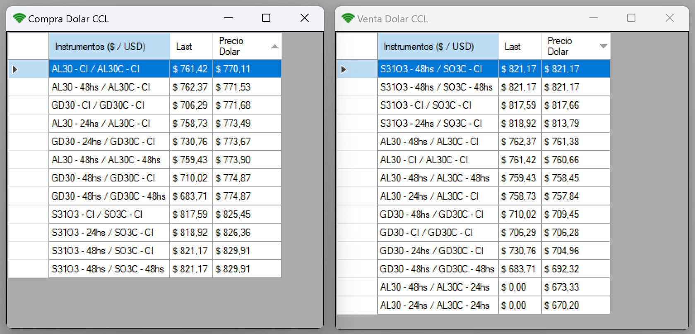
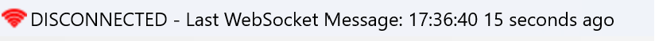

# Chucho Bot

## Requerimientos

Para poder ejecutar la aplicación es necesario:

- Windows
- Microsoft .Net Framework 4.7.2
- Acceso a Primary API provisto por ALyC (Matriz)

## ¿Cómo puedo ejecutar la aplicación?

Los releases se encuentran en la sección `Releases`

- Ir a la seccion [Releases](https://github.com/ChuchoCoder/chuchobot/releases)
- Descargar el archivo `ChuchoBot2023-10-02.zip`
- Descomprimir en una carpeta
- Configurar ALyC en archivo de configuración `ChuchoBot.exe.config` (ver instrucciones abajo)
- Ejecutar `ChuchoBot.exe`

## ¿Cómo configurar ChuchoBot para utilizar la Primary API de mi ALyC?

1. Editar archivo `App.config` (Desarrollo) o `ChuchoBot.exe.config` (Release)
2. Reemplazar setting `ApiBaseUrl` con URL provista por ALyC
	```xml
	<setting name="ApiBaseUrl" serializeAs="String">
		<value>https://api.cocos.xoms.com.ar</value>
	</setting>
	```
	Dependiendo del broker que te provee el acceso a Matrix, reemplazar el `value` del setting anterior por:
	- **Cocos Capital (requiere plan 🥥 Cocos Pro)**: `<value>https://api.cocos.xoms.com.ar</value>`
	- **Eco Valores**: `<value>https://api.eco.xoms.com.ar</value>`
	- **Veta Capital**: `<value>https://api.veta.xoms.com.ar</value>`
	- **Bull Market Brokers**: `<value>https://api.bull.xoms.com.ar</value>`

## ¿Cómo agregar/eliminar instrumentos a monitorear?

1. Editar archivo `App.config` (Desarrollo) o `ChuchoBot.exe.config` (Release)
2. Buscar setting `ArbitrationTickers` y agregar o quitar de la lista instrumentos 
```xml
<setting name="ArbitrationTickers" serializeAs="Xml">
    <value>
        <ArrayOfString xmlns:xsd="http://www.w3.org/2001/XMLSchema" xmlns:xsi="http://www.w3.org/2001/XMLSchema-instance">
        <string>AL29</string>
        <string>AL30</string>
        <string>AL35</string>
        <string>AE38</string>
        <string>AL41</string>
        <string>AY24</string>
        <string>GD29</string>
        <string>GD30</string>
        <string>GD35</string>
        <string>GD38</string>
        <string>GD41</string>
        <string>GD46</string>
        <string>GOLD</string>
        <string>AAPL</string>
        <string>AMZN</string>
        <string>BABA</string>
        <string>BIDU</string>
        <string>BRKB</string>
        <string>DISN</string>
        <string>KO</string>
        <string>MELI</string>
        <string>MRK</string>
        <string>MSFT</string>
        <string>NVDA</string>
        <string>PBR</string>
        <string>TSLA</string>
        <string>QCOM</string>
        <string>XOM</string>
        <string>DIA</string>
        <string>EEM</string>
        <string>XLE</string>
        <string>QQQ</string>
        <string>S31O3</string>
        <string>X18O3</string>
        </ArrayOfString>
    </value>
</setting>
```

## ¿Puedo utilizar la aplicación si no tengo acceso a Matriz?

No, la aplicación necesita tener acceso a Primary API (Matriz).

## ¿Cúal es mi usuario y contraseña para hacer Login?

El usuario y contraseña a utilizar es el mismo que se utiliza para ingresar en Matriz.



## Scanner de arbitraje de plazos



Haciendo doble clic en cualquier de las filas de la grilla se accede una ventana con el detalle del arbitraje. En dicha ventana se pueden cambiar los nominales, precios de compra/venta y comisión para poder obtener un cálculo aproximado de la ganancia/pérdida que se obtendría.



## Scanner para comprar/vender dolar MEP y CCL

La aplicación permite visualizar en tiempo real en que instrumentos conviene comprar y vender dolar MEP y CCL.

### Dolar MEP



### Dolar CCL



## ¿Por qué aparece el icono de WiFi rojo y el texto "DISCONNECTED"?

Cuando la aplicación deja de recibir datos por WebSocket, el icono de WiFi pasa de verde a rojo para avisar que puede existir algún problema con la conexión. Esto también ocurre antes de la apertura y luego de la finalización de la rueda.



Si esto ocurre mientras el mercado está abierto, se recomienda cerrar la apliación y volver a ejecutarla.

## ¿La aplicación recibe datos en tiempo real?

Sí, la aplicación se conecta por WebSocket a Primary API y la misma recibe los datos de los instrumentos en tiempo real.

## ¿La aplicación envía alguna orden de compra o venta?

No, la aplicación no emite o envía ninguna orden de compra y venta al mercado. Solamente permite visualizar las oportunidades de arbitraje que existen en tiempo real.
